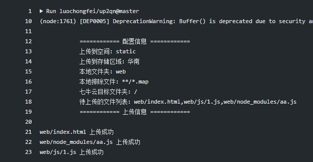

# up2qn
> up2qn 是一款 github Action 应用。可以通过 github workflow 将 github 文件内容自动同步到七牛云存储上。



## 应用名称
```bash
luochongfei/up2qn@master
```

## 亮点
- 使用 NodeJS SDK 预编译代码，初始化速度较快
- 对原有文件进行覆盖式上传，并在日志中有体现
- 支持指定本地目录
- 支持指定本地排除内容(glob格式)
- 支持目标目录

## 使用示例
```yml
name: 上传到七牛存储
on: push

jobs:
  job1:
    name: 上传到七牛云任务
    runs-on: Ubuntu-20.04
    steps:
    - name: 检索文件
      uses: actions/checkout@v2

    - name: 执行上传
      uses: luochongfei/up2qn@master
      with:
        bucket: static # 空间名称，按实际情况填写
        zone: 华南 # 存储区域，按实际情况填写 备注1
        access_key: ${{ secrets.AK }} # 七牛云 AccessKey 备注2
        secret_key: ${{ secrets.SK }} # 七牛云 SecretKey 备注2
        local_dir: web # 本地文件夹
        local_exclude: "**/node_modules/**" # 要排除的内容，要符合 glob 格式
        target_dir: / # 要上传到七牛云中的文件夹
```

> 备注1 存储区域从七牛云空间概览中获取，如华南、华东、华北、北美

> 备注2：上面有两个变量 secrets.AK, secrets.SK， 这种是github 秘密变量，在 github 仓库中头部选项卡 Settings -> Secrets 里配置，其中 secrets是固定的，AK、SK是自定义的名称，Value要从七牛云 [密钥管理](https://portal.qiniu.com/user/key) 中获取

## 参数说明
| 参数名 | 描述    |  默认值  | 可选值  |
| -------- | :------------- | :----  |:----  |
| bucket  | 空间名称  |  -  | - |
| zone   |  存储区域 | - | 华南、华东、华北、北美、东南亚 |
| access_key | 七牛云密钥 -> 公钥 | ${{ secrets.AK }} | - |
| secret_key | 七牛云密钥 -> 私钥 | ${{ secrets.SK }} | - |
| local_dir  |  本地文件夹（上传时不包含此文件夹本身）| dist | - |
| local_exclude  | 本地要排除的文件夹，需符合 glob 格式 *备注1* | - | - |
| target_dir  |  要上传到七牛云中的文件夹 | / | - |

> 备注1 多个可用逗号分隔，例如想排除 node_modules 文件和 所有 .map 后缀文件，可以这样写：
local_exclude: \*\*/node_modules/\*\*,\*\*/*.map
## 联系
- email: luochongfei@126.com
- QQ: 11423215